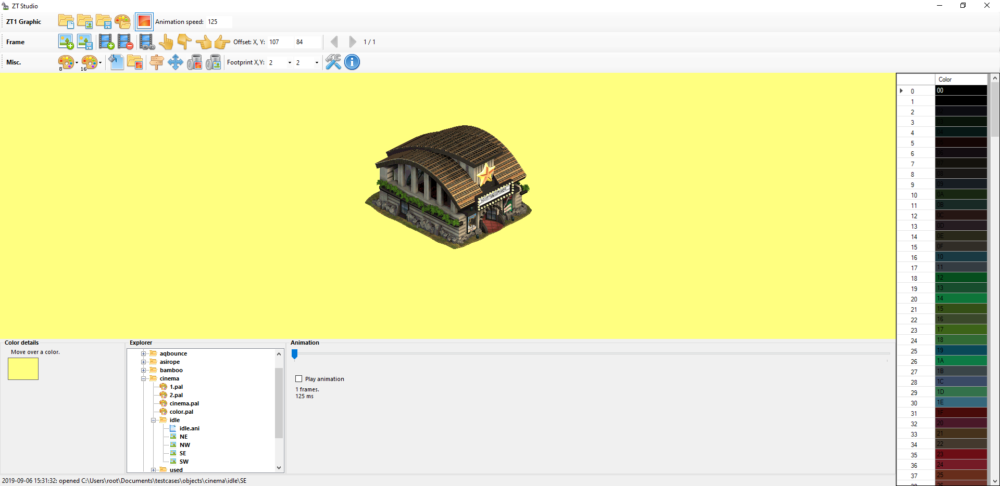

Welcome to the ZTStudio wiki!

# About the program
* [About ZT Studio](About-ZT-Studio)
* [Changelog](Changelog)

# General
* [Installation](Installation)
* [Terminology](Terminology)
* [Settings](Settings)
* [Command line](Command-line)

# How-to's
Some more detailed information on features
* [How to batch fix offsets](How-to-batch-fix-offsets) (a.k.a. "rotation fixing")
* [How to change name of a ZT1 folder containing graphics](How-to-change-name-of-a-ZT1-folder-containing-graphics)
* [How to create graphics of which colors can be customized in-game](How-to-create-graphics-of-which-colors-can-be-customized-in-game)
* [How to convert .PNG images to ZT1 Graphics in batch](How-to-convert-.PNG-images-to-ZT1-Graphics-in-batch)
  * [How to create a color palette to share with several graphics (views, animations) using GIMP](How-to-create-a-color-palette-to-share-with-several-graphics-(views,-animations)-using-GIMP)
* [How to recolor an official animal or object](How-to-recolor-an-official-animal-or-object)

# Technical information
* [ZT1 Graphics Explained](ZT1-Graphics-Explained)

# Support
There is no support for this program. Bug reports, feature requests or pull requests may be processed at some point; but it's not guaranteed at all.

* [Report issues/request features](https://github.com/jbostoen/ZTStudio/issues)
* Be as detailed as possible when reporting bugs; preferably include the files causing the problem.

# Other interesting info
* [ZT1 Sprites Script by Hendrix](https://github.com/HENDRIX-ZT2/ZT1-Sprites)
