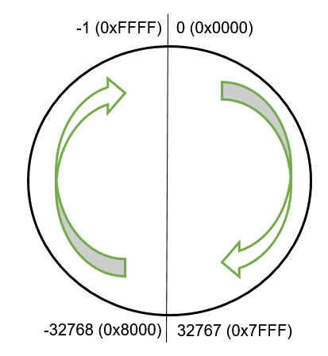

# ZT1 Graphics explained

## State of documentation
This contains all known info on the ZT1 Graphic file format.
The graphic format has been documented almost in its entirety.

For now, the purpose of two bytes (referring to them as "mystery bytes") is still unknown.
Most likely they represent one value.

## Definitions 
* **ZT1:** Zoo Tycoon (the original game, but this includes the expansions and official bonus content). Dinosaur Digs (DD) and Marine Mania (MM) are expansions. The game, its expansion packs and nearly all official bonus content [with some exceptions] are known as the Complete Collection (CC). 
* **ZT1 Graphic:** this file tells the ZT1 game how/where to render pixels. Colors are stored in a separate but required ZT1 Color Palette file, which is usually - but not necessarily - stored in the same directory. A ZT1 graphic consists of at least 1 frame.
* **ZT1 Color Palette:** has a .pal-extension. Contains the colors used in a ZT1 Graphic.
* **ZT1 Frame:** 1 image/drawing/picture
* **ZT1 Animation:** this would be all views (individual graphics representing a different side of the object or creature) making up an animation.
* **View:** a graphic has different sides (views, often directions). 
  * Objects usually have of 4 views: NE (North East), NW (North West), SE (South East), SW (South West). 
  * Creatures can move (animal, guest, staff, ...). They have N (North), NE (North East), E (East), SE (South East), S (South). 
    * The missing directions are simply rendered as mirrored versions of the above! (NE -> NW, SE -> SW)
  * Icons and plaques have just 1 graphic
  * Fences, tank walls and paths also have multiple views.
  * Same for some special graphics (related to UI, or dust cloud for example)


## Variations

The game engine uses (at least) 4 different variations of the ZT1 Graphic format.
* **Non-animated. Basic.** Appears as a non-animated object.
  * Appears as a still image.
  * One frame per view (still)
  * Example: Bamboo
* **Animated. Basic.** 
  * Appears as an animated object.
  * Multiple frames per view (animation)
  * Example: Fire
* **Animated. With additional background frame.** 
  * Appears as an animated object.
  * Multiple frames per view (animation)
    * Each frame only contains the parts which change; for instance a smoke/sign/windows lighting up.
	* The last frame is used as a background frame for all others; for instance the actual building (all still parts)
	* Benefit: rendered faster, smaller file size (used to be important since Internet was much slower and bandwidth limited)
  * Example: the Restaurant. 
* **Shadows.**
  * Likely introduced in Marine Mania. Simply put, there's no need for a color palette since only the color black is used. 
  * Example: dolphin's underwater shadow in certain animations (for instance **ssubeat**).
  * Strangely enough:
    * not used for all the shadow animations of the dolphin.
    * still refers to a color palette

There's another very minor difference in those variations.
Lots of graphics start with bytes which form 'ZTAF' (probably ZT Animation File or something like that; very often graphics which are animated and have an additional background frame).

### Graphic capability comparison

| Action                                          | APE    | ZOOT    | ZT Studio    |
| ----------------------------------------------- | ------ | ------- | ------------ |
| Read non-animated basic graphic                 | Yes    | Yes     | Yes          |
| Write non-animated basic graphic                | Yes    | Yes     | Yes          |
| Read animated basic graphic                     | Yes    | Yes     | Yes          |
| Write animated basic graphic                    | Yes    | Yes     | Yes          |
| Read animated graphic with background frame     | No     | No      | Yes          |
| Write animated graphic with background frame    | No     | No      | Yes          |
| Read shadow graphic                             | No     | No      | Yes          |
| Write shadow graphic                            | No     | No      | No           |


## Interesting graphics

Here's a short list of graphics which are interesting to study. This repository also contains a PowerShell script to extract them all!

* **animals / dolphin's ssurfswi**
  * Found in Marine Mania
  * Compressed format for shadows. 
  * Multiple frames.
  * No ZTAF-bytes.
* **objects / bamboo**: 
  * Basic graphic. 
  * 1 frame.
  * No ZTAF-bytes.
* **objects / cinema**: 
  * Found in Dinosaur Digs. 
  * ZTAF-bytes.
  * Background frame.
  * The **used** animation's SW-view comes to 250kb. It's most likely the graphic which contains the largest number of pixels which need to be drawn. (*verification needed*). 
  * The **idle** animation contains 1 frame and a background frame. It's different from the Restaurant: this frame renders some additional elements on the background frame. Again, it doesn't seem to be necessary to split this up.
* **objects / showbuoy**: 
  * Found in Marine Mania. 
  * Largest width in game, but doesn't require a lot of pixels to be drawn.
  * Multiple frames.
  * No ZTAF-bytes.
* **objects / restrant**:
  * Found in Zoo Tycoon.
  * Likely one of the earliest ingame graphics. 
  * ZTAF-bytes. 
  * The **used** animation contains a background frame, everything else is rendered on top. 
  * The **idle** animation uses the same principle: an empty frame (no width, height, offsets) is rendered on top of the background frame. 
* **objects / testbox**: 
  * Found in Marine Mania. 
  * No ZTAF bytes.
  * 1 frame.
  * Why not use Blue Fang's test object? It should make the entire grid/tile invisible.

* objects/swnglog
  * one of the first animal toys. Since Elephant is shown in "used" animation, this is an exclusive toy for the Elephant. Remarkably it's only 2x2 (footprint, so 1 square) and has no shadow.
* combination of **animals/orngutan/m/rpgeton , rpgetoff, rpdangle, rpswing** and **objects/asirope/used** animations (Endangered Species / Complete Collection).
  * animal and toy form a combined animation (some ropes are in the Orang Utan's animations)
* combination of **objects/dinoputt** and **guests/man/puttentr, puttexit, puttwin, puttlose** (or woman)
  * guest and building form a combined animation (some parts of the dinosaur are in the guest animations)

## Limitations

* A **color Palette** contains maximum 255 colors + 1 transparent color (= will be invisible in ZT1).
* A single **ZT1 Graphic** is thus limited to 255 colors + 1 transparent color. 
  * This means **each view** is limited to 255 colors. 
  * However, if they don't share their color palette, you can use more than 255 colors among all views.

To check:
* is there a file size limit?
* there's probably a limit (255?) of the number of drawing instructions in a pixel row.
* there's definitely an image dimension (height/width) limit - the Marine Mania show buoy area has one of the largest in-game widths and might be a starting point. 
* other limits?

## Some notes

* A single **byte** can have values ranging from 0000 0000 to 1111 1111 in binary form, which can be more conveniently represented as **00 to FF in hexadecimal**.

* In its most common usage, endianness indicates the ordering of bytes within a multi-byte number. 
* A big-endian ordering places the most significant byte first and the least significant byte last.
* A little-endian ordering does the opposite.
* ZT1 uses little-endian for values. For example: 125 (decimal) becomes 7D (hexadecimal). 
  * If ZT1 reserves 4 bytes to define this value, this would commonly (big-endian) be "7D 00 00 00".
  * However, it uses little-endian; so reverse: "00 00 00 7D"
  
* ZT1 uses signed integers (indicating + or -). Those values range from -32768 to 32767.

* [TechnoSoft - The negative numbers representation in hex](http://www.technosoft.ro/KB/index.php?/article/AA-15440/0/The-negative-numbers-representation-in-hex.html)
  
## Explanation of color palettes

Simply put: a color palette is an overview, which lists all unique colors used in one or more graphics.

* First 4 bytes tell how many colors the palette contains. The format of these files is in Little Endian though, which means bytes needs to be reversed.
* **For each color**, there are 4 bytes.
  * These are the RGBA (red, green, blue, alpha) values of each color. 
    * The alpha level is typically FF. Only the first color **might** have a transparency byte of 00.
	* Tools like APE and ZOOT (?) typically always create a palette with 255 colors (+1 transparent color), even if the graphic doesn't have 255 unique colors.

## Explanation of the ZT1 Graphic format
Technical limitations have been listed, but it's mostly based on theory. They have not been verified!

* **Optional: first 9 bytes, which define the file type**
  * The different variations in the ZT1 Graphic can be identified quite simply, as they indicate 3 out of the 4 possibilities.
    * If the first 4 bytes spell "FATZ" (or reversed, since it's using Little Endian: ZTAF), then the game will consider this as an animation file. 
	* The next 4 bytes will all be 00. 
	* The 9th byte will be either:
	  * 00 (no extra frame) (Example: <to be added>)
      * 01 (extra frame = background frame) (Example: Restaurant). 
    * If these optional bytes aren't present, this is a very basic ZT1 Graphic. (Example: Bamboo)  
	
* **Animation speed**
  * Value specified in 4 bytes.
  * Value is expressed in milli seconds. The time to pass before the next frame is shown.
  * This is part of the graphic, it is not set per frame!
  * Note that all values are stored in bytes in Little Endian format.
    * "In its most common usage, endianness indicates the ordering of bytes within a multi-byte number. A big-endian ordering places the most significant byte first and the least significant byte last, while a little-endian ordering does the opposite."
    * In human language: the bytes in ZT1 Graphics are stored in a reversed way.
	* Let's say animation speed is set to 125 ms. 125 decimal = 7D hex. In 4 bytes, this would become **7D 00 00 00**. Applying little-endian (**reversing**), this becomes **00 00 00 7D**. 
  * Technical limitation (assuming all these bytes are indeed used for animation speed): 2.147.483.647 (2^31 − 1)
	* Just in case the assumption is wrong, and it's stored in 2 bytes (with the others serving an unknown purpose): 32767 (2^15 − 1)
	
* **Length of filename of the color palette**
  * Value specified in 4 bytes.
  * Value is the length of the file name of the color palette; relative to 'root'. (top folder structure)
  
* **Filename of the color palette**
  * Each character gets its own byte.
  * After the filename comes "00". This is a NULL character, most likely to signify the end of the file name.
  
* **Number of frames**
  * Value specified in 4 bytes.
  * A graphic file contains at least 1 frame.
  * Careful: if it has been indicated that there is a background frame; it does **NOT** count here!
  * Technical limitation (assuming all these bytes are indeed used for animation speed): 2.147.483.647 (2^31 − 1)
	* Just in case the assumption is wrong, and it's stored in 2 bytes (with the others serving an unknown purpose): 32767 (2^15 − 1)
	
* **For each frame (including background frame, if present)**
  * **Amount of bytes to follow, defining the frame**
    * Value specified in 4 bytes
	* Technical limitation: 32767 (2^15 − 1)
  * **Height**
    * Value specified in 2 bytes
	* Special case: if the second byte is **80**, this seems to indicate that it's a shadow format (only using black and **NO** color palette) (example: dolphin - **ssurfswi** animation).
	  * Despite this, the other byte still indicates the height of the image (here limited to 255 or 256?)
	* Technical limitation: 32767 (2^15 − 1)
  * **Width**
    * Value specified in 2 bytes
	* Technical limitation: 32767 (2^15 − 1)
  * **Vertical offset (Y)**
    * Value specified in 2 bytes
	* Technical limitation: between -32768 and 32767 (can be negative, signed integer)
  * **Vertical offset (X)**
    * Value specified in 2 bytes
	* Technical limitation: between -32768 and 32767 (can be negative, signed integer)
  * **Mystery bytes**
    * Value specified in 2 bytes? (most likely)
	* This is the only value of which the purpose is currently still unknown.
	* APE always seems to set this to 00 01
	* It must be related to something on frame-level rather than graphic-level
    * If anyone knows/finds out, please share this in the issues list!
	* It does not seem to be...
	  * Number of bytes left in the frame
	  * Number of drawing instructions in the frame
	  * Number of colors used in the frame
	  * Number of pixels which actually get a color in the frame
	  * ...
  * **For each horizontal line of pixels in the frame**
    * **Number of drawing instructions**
	  * Value specified in 1 byte
	  * Technical limitation: 255 color blocks (can another one follow?)
	* **For each color block in this line**
	  * **Offset value**
	    * Value specified in 1 byte
		* Technical limitation: offset is between 0 and 255. (skip X pixels in line; then start drawing)
	  * **Number of colors (in this drawing instruction)**
	    * Value specified in 1 byte
		* Technical limitation: number of colors to follow (pixels to draw) is between 0 and 255.
	  * **For each color in this color block (if any)**
	    * Value specified in 1 byte
		* Technical limitation: color index is between 0 (transparent anyhow) and 255. Refers to the index of the color in the used color palette. Careful: hex values!
	  * Some examples:
        * A typical block: 07 02 15 13
	      * Move 7 pixels to the right; the skipped ones are transparent
		  * There will be 2 pixels to draw
		  * Draw a pixel with color HEX 15 => DEC 21 in the color palette (index = starts at 0; so 20th color)
		  * Draw a pixel right next to the previous one with color HEX 13 => DEC 19 in the palette. (index = starts at 0; so 20th color)
		* Last block of the line: 08 00
		  * Move 8 pixels to the right (reaching maximum width)
		  * There will be 0 pixels to draw (end of line)
		* Shadow block: 40 02
		  * This is a compressed drawing instruction. It only draws black so contains no color indexes!
		  * Move 40 pixels to the right.
		  * Draw 2 black pixels next to each other.
		
      
By now, all information about the graphic has been put into bytes. 

Sometimes, there seem to be random bytes at the end of the file which are useless. 
They are ignored by the game, because the actual relevant pixels were defined earlier on.
APE usually adds these kind of junk bytes to the end of files.

## Explanation of .ani files

**.ani** stands for animation. It is a file that can be opened with any text editor (recommendation: NotePad++)

It's another file which looks a lot like an .INI-file.
An example for the used animation of the Restaurant:

```
[animation]
dir0 = objects
dir1 = restrant
dir2 = used
animation = NE
animation = SE
animation = SW
animation = NW
x0 = -138
y0 = -176
x1 = 138
y1 = 72
```

* It starts with a section named **animation**.
* The section contains **multiple keys**.
  * it starts with listing the relative path to this file. Each directory in this path get its own line. It's numbered, starting from 0: dir0, dir1, dir2, ... 
  * animation: 
    * There is a line for each view of this graphic. Their directions are listed in order.
	* For icons and plaques, there is only one view; so coordinates only refer to that one view.
	* Commonly:
	  * 1 ZT1 Graphic, for instance all sorts of icons, plaques: N
	  * 4 ZT1 Graphics, usually non-moving objects: NE, SE, SW, NW
	  * 5 ZT1 Graphics, usually moving objects: N, NE, E, SE, S
	  * 20 ZT1 Graphics, usually paths: 1, 2, 3, ... , 20
  * offsets: basically defining the canvas.
    * x1 = x0 + image width
	* y1 = y0 + image height
	* But what determines x0 and y0?
	  * For icons and plaques, there is only one graphic, so it's easy to see where offsets come from.
	  * For other animations with multiple views (perhaps with multiple frames), it's unknown where the offsets come from. 
	    * It is possible (likely?) that the game completely ignores the offsets in the .ani file
	    * ZT Studio generates these coordinates by going over all frames and picking the most top left and bottom right pixel found in the frame(s) of all views.
	  
